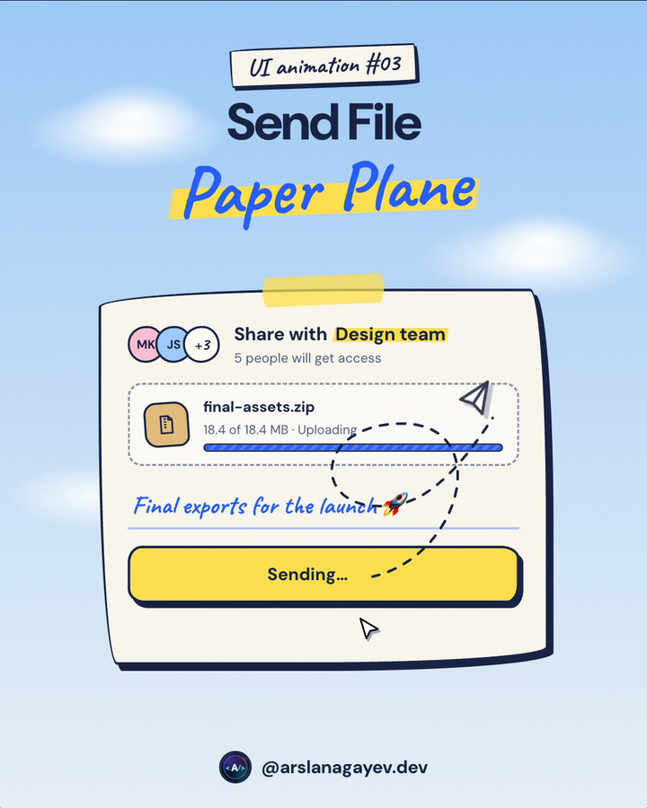

# Send File Paper Plane

A send button that fills with upload progress, then launches a paper plane that loops once along a dashed trail and flies off the card.



**[Live demo](https://arslanagayev.github.io/send-file-animation/)** · **[Reel mode](https://arslanagayev.github.io/send-file-animation/?reel)** · UI animation #03 of a weekly series on Instagram [@arslanagayev.dev](https://www.instagram.com/arslanagayev.dev/)

Plain **HTML, CSS and JavaScript**: no frameworks, no build step, no dependencies. Click **Send** and watch the plane.

## How it works

1. On **Send**, a highlighter-yellow sweep fills the button from left to right with the upload progress, and the file card shows the uploaded megabytes.
2. At 100% the paper plane leaves the button and follows a curved path with a **loop-the-loop**.
3. A dashed trail is revealed behind the plane as it flies, then fades away.
4. The button turns green with **Sent ✓** and the file shows *Delivered to 5 people*.

## Features

- One SVG path drives both the plane (CSS `offset-path`) and its trail
- The dashed trail is revealed with an SVG mask (`stroke-dashoffset` on a solid stroke)
- Upload progress driven by `requestAnimationFrame` with an ease-out curve
- `aria-live` status message and `prefers-reduced-motion` support
- Paper look without images: ink outlines, wobbly hand-drawn corners (an 8-value `border-radius`), SVG-noise paper grain, a tape strip and a ruled-notebook code window. Fonts: Caveat + DM Sans

## The key code

```js
// One path drives both the dashed trail and the plane
trail.setAttribute('d', path);
plane.style.offsetPath = `path('${path}')`;

// Reveal the trail with a mask while the plane flies
mask.animate(
  [{ strokeDashoffset: length }, { strokeDashoffset: 0 }],
  flight,
);
plane.animate([
  { offsetDistance: '0%', transform: 'scale(.8)' },
  { offsetDistance: '55%', transform: 'scale(1.25)' },
  { offsetDistance: '100%', opacity: 0 },
], flight);
```

## Use it in your project

Copy `index.html`, `style.css` and `script.js`. The component itself has no dependencies; the `reel/` folder is only used by the reel mode described below. To drop it, delete the `mountReel(...)` call at the end of `script.js` and its import on the first line.

## Reel mode

Add `?reel` to the URL and the page becomes a self-playing 1080×1920 video stage: a title, the animation driven by a scripted cursor, a code excerpt and an end card, on a loop. Open it on a phone and use the built-in screen recorder to get an Instagram reel. `?autoplay` loops the scripted demo without the frame.

Options:

- `?reel&ratio=4x5`: a 1080×1350 stage for Instagram carousel videos
- `?reel&nocode`: hide the code excerpt
- `?reel&delay=3000`: wait 3 seconds before the first run (time to start the recorder)

## Run locally

ES modules don't load from `file://`, so serve the folder:

```bash
git clone https://github.com/arslanagayev/send-file-animation.git
cd send-file-animation
python3 -m http.server 8080   # then open http://localhost:8080
```

## License

[MIT](LICENSE) © 2026 Arslan Agayev
